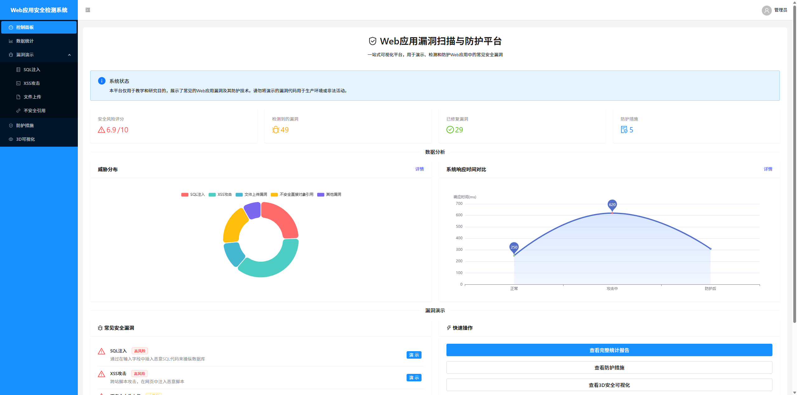

# 🛡️ Web安全漏洞演示与可视化平台 🛡️

## 📋 项目简介

这是一个专为教育和演示目的设计的Web安全漏洞平台，旨在帮助安全爱好者、开发人员和学生深入了解常见的Web安全漏洞。通过交互式演示和直观的3D可视化，用户可以全面理解各种安全威胁的工作原理及其潜在影响。



> ⚠️ **免责声明**: 本项目仅供教育目的使用。请勿将其中的技术用于未授权的安全测试或攻击行为。

## 🚀 特性亮点

- 🔍 **交互式漏洞演示** - 亲身体验常见Web安全漏洞
- 🌐 **3D安全态势可视化** - 直观展示系统架构与潜在威胁
- 🎮 **沉浸式用户体验** - 引人入胜的界面和生动的视觉效果
- 📊 **详细的安全解释** - 每个漏洞都配有深入解析和防护建议
- 📱 **响应式设计** - 适配桌面和移动设备的界面布局

## ✨ 最新功能改进

### 3D安全态势可视化增强 (2023年7月更新)

我们对3D安全态势可视化功能进行了全面升级：

- 🎮 **增强交互性** - 用户现在可以使用鼠标自由旋转、缩放和平移3D模型
- 🖼️ **高清模型** - 全新高质量3D模型，更加逼真和美观
- 🌈 **动态光影效果** - 添加了光照、阴影和粒子效果，提升视觉体验
- ⚡ **实时攻击模拟** - 动态展示攻击路径，包括动画效果
- 🔄 **模式切换** - 提供标准、威胁和漏洞三种可视化模式
- 📱 **全屏与响应式支持** - 优化全屏显示和不同设备适配

## 🔧 技术栈

### 前端
- ⚛️ **React** - 用户界面库
- 📘 **TypeScript** - 类型安全的JavaScript超集
- 🔄 **Vite** - 现代前端构建工具
- 🌈 **Ant Design** - UI组件库
- 🎨 **Styled Components** - CSS-in-JS解决方案
- 🔺 **Three.js** - 3D可视化渲染引擎

### 后端 (可选，当前版本使用模拟数据)
- 🐍 **Python** - 后端语言
- 🌶️ **Flask** - 轻量级Web框架
- 🔐 **SQLite** - 数据存储

## 💻 支持的漏洞演示

本平台目前支持以下安全漏洞的交互式演示:

- 💉 **SQL注入** - 展示如何通过恶意SQL代码破坏数据库安全
- 🔓 **XSS攻击** - 演示跨站脚本攻击及其影响
- 📁 **文件上传漏洞** - 展示恶意文件上传的危险性
- 🔑 **不安全的直接对象引用(IDOR)** - 演示访问控制不当的风险
- 🔍 **信息泄露** - 展示敏感信息泄露场景
- 🔒 **权限提升** - 演示用户权限提升的威胁

## 🔍 3D安全态势可视化

平台提供了先进的3D安全态势可视化功能:

- 🏢 **系统架构组件的立体展示** - 包括服务器、数据库、API端点、客户端和攻击者
- 🔗 **组件间交互关系的动态连接** - 通过3D线条展示系统组件之间的连接关系
- 🚨 **潜在攻击路径的高亮显示** - 使用醒目颜色和动画效果突出显示攻击路径
- 📊 **不同风险级别的直观颜色编码** - 从低风险到严重风险的颜色渐变
- 🎛️ **可交互控制的视图配置** - 支持旋转、缩放、平移和场景控制
- 🔄 **可选的自动旋转** - 提供自动旋转视图，方便全方位观察系统架构

## 🛠️ 安装及运行

### 前提条件
- Node.js (v14+)
- npm 或 yarn

### 安装步骤

1. 克隆或下载项目代码
   ```bash
   # 从GitHub克隆
   git clone https://github.com/MilesSG/Python_Based_Web_Security_Project.git
   cd Python_Based_Web_Security_Project
   ```

2. 安装前端依赖
   ```bash
   cd frontend
   npm install
   ```

3. 运行应用
   
   启动前端服务:
   ```bash
   cd frontend
   npm run dev
   ```

4. 在浏览器中访问应用
   ```
   http://localhost:5178/  # 端口可能会有所不同，请查看终端输出
   ```

> 📝 **注意**: 当前版本使用模拟数据运行，无需启动后端服务。API调用已配置为使用前端模拟数据，以便演示所有功能。

### 可选：启动后端服务（如需使用真实API）

如果您想使用真实的后端API而非模拟数据，请按以下步骤操作：

1. 安装后端依赖
   ```bash
   cd backend
   python -m venv venv
   # Windows上使用
   venv\Scripts\activate
   # Linux/macOS上使用
   # source venv/bin/activate
   pip install -r requirements.txt
   ```

2. 启动后端服务:
   ```bash
   cd backend
   python app.py
   ```

3. 修改前端配置：
   打开 `frontend/src/api/api.ts` 文件，将 `const USE_MOCK_DATA = true;` 修改为 `const USE_MOCK_DATA = false;`

## 📝 使用指南

1. 🏠 **首页概览** - 浏览可用的漏洞演示
2. 💡 **选择漏洞类型** - 点击任意卡片进入相应演示
3. 🔬 **交互式学习** - 按照指引操作，体验漏洞效果
4. 🛡️ **防御建议** - 查看如何防范相应漏洞的建议
5. 🌐 **3D态势感知** - 探索系统架构与潜在威胁的可视化表示
   - 使用鼠标左键旋转视图
   - 使用鼠标滚轮缩放
   - 使用鼠标右键平移视图
   - 通过控制面板调整显示选项

## 🌟 未来计划

- 🆕 增加更多漏洞类型的演示
- 📊 添加漏洞统计与分析功能
- 🧪 集成自动化测试工具
- 📱 开发移动应用版本
- 🌍 支持多语言界面
- 🎓 添加互动式教程和学习路径

## 👥 贡献指南

欢迎贡献代码、报告问题或提出新功能建议!

1. Fork 项目
2. 创建功能分支 (`git checkout -b feature/amazing-feature`)
3. 提交更改 (`git commit -m 'Add some amazing feature'`)
4. 推送分支 (`git push origin feature/amazing-feature`)
5. 创建 Pull Request

## 📄 许可证

该项目采用 MIT 许可证 - 详情参见 [LICENSE](LICENSE) 文件

## 📞 联系方式

项目维护者 - [@MilesSG](https://github.com/MilesSG)

---

🔒 安全始于了解，教育创造安全的未来! 